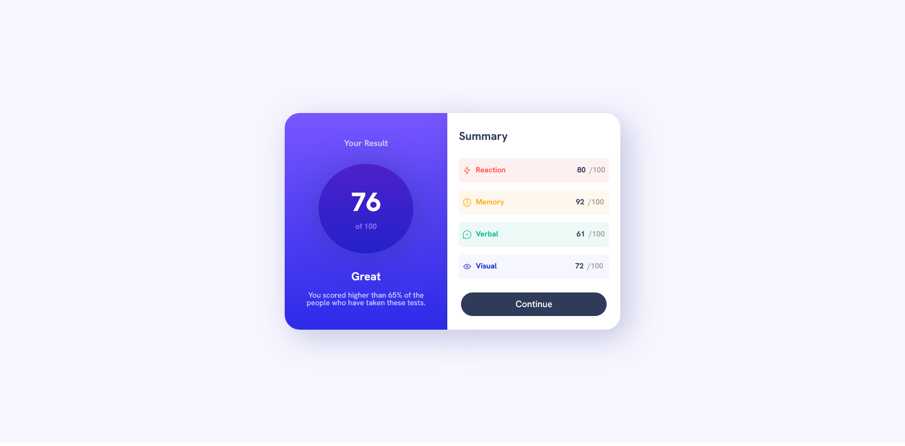

# Frontend Mentor - Results summary component solution

Essa é uma solução para o projeto do Frontend Mnetor [Results summary component challenge on Frontend Mentor](https://www.frontendmentor.io/challenges/results-summary-component-CE_K6s0maV). Frontend Mentor challenges ajudam a desenvolver suas habilidades de codigo, construindo projetos realistas.

## Table of contents

- [Overview](#overview)
  - [The desafio](#o-desafio)
  - [Screenshot](#screenshot)
  - [Links](#links)
- [Meu processo](#meu-processo)
  - [Construido com](#construido-com)
  - [O que eu aprendi](#o-que-eu-aprendi)
  - [Fontes utilizadas](#fontes-utilizadas)
- [Autora](#Autora)

## Overview

### O Desafio

Os usuários devem poder:

- Ver o layout ideal para a interface, indipendente do tamanho de tela de seus aparelhos
- Ver hover e estados de focus para todos os elementos interativos na página

### Screenshot

### Links

- Solution URL: [Add solution URL here](https://your-solution-url.com)
- Live Site URL: [Add live site URL here](https://your-live-site-url.com)

## Meu Processo

### Construido com

- Marcação HTML5 semântica
- Propriedades personalizadas do CSS
- Flexbox
- Mobile-first workflow

### O que eu aprendi

Eu entendi melhor sobre o uso de estilos de bordas e sombras durante o processo de construção da página, além disso, acredito que aprendi a otimizar e deixar o código mais limpo.

Com relação ao HTML5 aprendi a estruturar melhor a página visto que fui organizando as sessões conforme terminava de estilizá-las, antes eu costumava escrever todo o HTML para então estilizar a página e às vezes o código ficava mal estruturado.

Ao utilizar variáveis consegui evitar a repetição desnecessária e facilitar a edição do documento. Durante a criação de classes tentei aplicar um pouco da arquitetura BEM.

### Fontes Utilizadas

- [Documentação CSS MDN Docs](https://developer.mozilla.org/pt-BR/docs/Web/CSS) - utilizei bastante a documentação quando estava estilizando bordas e adicionado sombra as seções. Também durante o uso do Flexbox para centralizar elementos.

- [Artigo Alura](https://dev.to/sucodelarangela/como-aplicar-opacidade-em-background-image-sem-afetar-textos-31fj) - Esse artigo me ajudou a aplicar opacidade sem atrapalhar o objeto acima do fundo na sessão.

## Autora

- Frontend Mentor - [@RaiRaiCidade](https://www.frontendmentor.io/profile/RaiRaiCidade)
